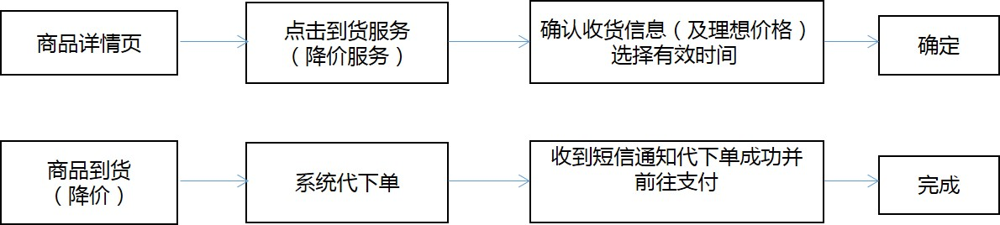

# 客户服务FAQ

## 公告

## 自助服务

售后申请

价格保护
交易纠纷
###配送服务
###我要催单

###自提查询

## 订单类
取消订单查询
修改收货地址
价格保护申请
无货商品咨询

## 配送类
联系配送员
物流信息查询
能否提前配送
特色配送服务

## 售后类
如何申请售后
售后审核时效
今后处理时效
售后退款时效

## 财务类
支付方式
优惠券介绍
未收到发票
电子发票介绍

## 账户类
绑定手机号码
找回登录密码
修改个人信息
会员级别划分

## 活动&购买
购物流程
合约机介绍
活动未获优惠
满返满赠介绍 

## 特色服务

### 一键购

**什么是一键购？**

为了节省您的购买时间，简化下单流程步骤，京东推出了“一键购”功能。当将收货地址设置支付配送方式升级为一键购后，即可在商品页面点击一键购直接下单。

**如何设置一键购？**
_*方法一*_
在【我的京东-收货地址】中进行设置一键下单地址，在右下方点击使用一键购，点击后左上方会有标记显示为一键购地址
_*方式二*_
未设置一键购用户点击商品详情页的一键购进入结算页，用户下单后，此次的下单信息将会被保存为一键购的下单设置；
注：已设置“一键购”用户，在商品详情页鼠标悬停在“一键购”上会显示支付和收货地址信息，点击之后直接按照该地址下单

**一键购如何下单？**
一键购支持“一键下单”，点击一键购按钮后直接提交订单。

**如何修改或者更换一键购地址？**
1、更换地址：在【我的京东-收货地址】新增一个收获地址，点击使用一键购
2、修改地址：如在原有一键购地址情况下客户需要修改手机号、姓名等在【我的京东-收货地址】进行编辑即可。

**一键购支持购买哪些商品？**
可购买京东平台上需要物流配送的实物商品，包括入驻商家的实物商品；不能购买虚拟类（如：电子书、数字音乐、应用、充值、电子票等）、合约机类、服务类商品；但不能购买无货或下柜商品；不能购买京东价小于10元的商品。具体以网页是否有【一键购】按钮为准。

**一键购下单支持哪种支付方式？**
可以支持在线支付、货到付款、上门自提，具体以默认一键购设置的支付方式下单。

**一键购下单支持哪种配送方式？**
京东快递配送区域内的商品由京东负责配送，京东配送范围以外以及第三方卖家出售的商品将由第三方快递公司配送。

**一键购下单如何开发票？**
自营商品默认开具普通发票（个人、明细），图书及第三方卖家商品默认不开发票。

**一键购下单可享受商品参与的促销优惠吗？**
一键购订单同样可享受商品参与的促销优惠。但不包括需要客户选择赠商品的促销方式。

**一键购下单可以使用优惠券、京东卡/京东E卡、京豆吗？**
一键购下单不可以使用优惠券、京东E卡、京豆。

**一键购订单可以取消吗？**
一键购订单与普通订单一样可以取消。

### 代下单
1、 什么是京东代下单？

京东代下单是建立在降价通知和到货通知的基础上的升级服务，用户订阅之前预留电话、地址等个人信息，并选择支付方式和有效时间，当订阅商品在有效时间内到货或者降价到用户期望价格，系统将会自动为用户下单，并以短信和消息提醒的方式通知用户下单成功。注：此功能仅金牌及金牌以上会员适用

2、 代下单操作流程图：

 

3、什么样的商品不能提供代下单服务？

因商品特殊属性，抢购、预约、预售等商品不能提供代下单服务。

4、为什么我订阅的商品有到货/降价，却没有为我下单？

商品是否有货/降价以电脑版为准，手机端到货/降价电脑端不提供代下单；

有些商品由于活动时段或特殊属性不能成功代下单。

5、其他说明

   代下单服务默认在线支付，运费及配送方式以实际下单为准。

   发票默认普通发票（纸质）个人明细，图书及第三方配送商品不开发票。

